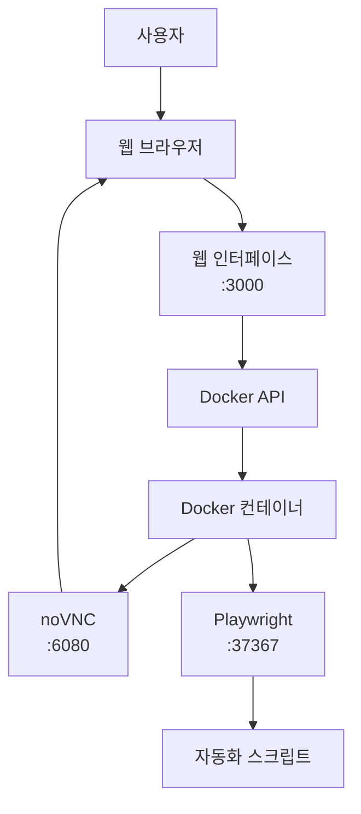

# Magentic UI Browser Interface - 프로젝트 구조

## 📁 디렉토리 구조

```
magentic-ui/
├── docker/magentic-ui-browser-docker/     # Docker 컨테이너 설정
│   ├── Dockerfile                         # Docker 이미지 정의
│   ├── supervisord.conf                   # 서비스 관리 설정
│   ├── playwright-server.js               # Playwright 서버
│   ├── package.json                       # Node.js 의존성
│   ├── start.sh                          # 컨테이너 시작 스크립트
│   ├── entrypoint.sh                     # 컨테이너 진입점
│   ├── x11-setup.sh                      # X11 설정 스크립트
│   ├── openbox-rc.xml                    # OpenBox 윈도우 매니저 설정
│   └── build.sh                          # 이미지 빌드 스크립트
│
└── browser-interface/                     # 웹 인터페이스
    ├── index.html                        # 기본 웹 인터페이스
    ├── enhanced-index.html               # API 연동 웹 인터페이스
    ├── docker-manager.js                # Docker 관리 서버
    ├── package.json                     # Node.js 프로젝트 설정
    ├── start.sh                         # 인터페이스 시작 스크립트
    ├── quick-start.sh                   # 빠른 시작 스크립트
    ├── README.md                        # 사용 가이드
    └── PROJECT_STRUCTURE.md             # 이 파일
```

## 🚀 시작하기

### 빠른 시작

```bash
cd browser-interface
./quick-start.sh
```

### 단계별 시작

1. **의존성 설치**
   ```bash
   cd browser-interface
   npm install
   ```

2. **Docker 이미지 빌드**
   ```bash
   npm run build-image
   ```

3. **웹 서버 시작**
   ```bash
   npm start
   ```

4. **브라우저에서 접속**
   - http://localhost:3000

## 🏗️ 아키텍처

### Docker 컨테이너 구성

```
┌─────────────────────────────────────┐
│         Docker Container            │
├─────────────────────────────────────┤
│  Xvfb (가상 디스플레이)              │
│  OpenBox (윈도우 매니저)             │
│  Chromium (웹 브라우저)              │
│  x11vnc (VNC 서버)                  │
│  noVNC (웹 VNC 클라이언트)           │
│  Playwright Server (자동화)         │
└─────────────────────────────────────┘
           ↕ 포트 6080, 37367
┌─────────────────────────────────────┐
│      호스트 시스템                   │
│                                     │
│  ┌─────────────────────────────┐    │
│  │   웹 인터페이스 서버         │    │
│  │   (Node.js + Express)       │    │
│  │   포트 3000                 │    │
│  └─────────────────────────────┘    │
└─────────────────────────────────────┘
```

### 웹 인터페이스 플로우



## 📋 주요 기능

### 웹 인터페이스 (browser-interface/)

- **docker-manager.js**: Express 서버로 Docker 컨테이너 관리
- **enhanced-index.html**: 실제 API와 연동되는 웹 인터페이스
- **index.html**: 시뮬레이션 버전의 웹 인터페이스

### Docker 컨테이너 (docker/magentic-ui-browser-docker/)

- **Xvfb**: 헤드리스 X11 디스플레이 서버 (:99)
- **OpenBox**: 최소한의 윈도우 매니저
- **Chromium**: Playwright로 제어되는 웹 브라우저
- **x11vnc**: VNC 서버 (포트 5900)
- **noVNC**: 웹 기반 VNC 클라이언트 (포트 6080)
- **Playwright**: 브라우저 자동화 서버 (포트 37367)

## 🔧 설정

### 환경 변수

#### 웹 인터페이스
- `PORT`: 웹 서버 포트 (기본값: 3000)
- `NODE_ENV`: 실행 환경

#### Docker 컨테이너
- `DISPLAY`: X11 디스플레이 (:99)
- `PLAYWRIGHT_WS_PATH`: Playwright 웹소켓 경로 (default)

### 포트 매핑

| 서비스 | 컨테이너 포트 | 호스트 포트 | 용도 |
|--------|---------------|-------------|------|
| noVNC | 6080 | 6080 | 웹 VNC 클라이언트 |
| Playwright | 37367 | 37367 | 브라우저 자동화 |
| 웹 인터페이스 | - | 3000 | 관리 웹페이지 |

## 🔄 워크플로우

1. **이미지 빌드**: `npm run build-image`
2. **서버 시작**: `npm start`
3. **컨테이너 관리**: 웹 인터페이스에서 시작/중지
4. **브라우저 접속**: noVNC를 통해 가상 브라우저 사용
5. **자동화**: Playwright API로 브라우저 제어

## 🛠️ 개발

### 디버깅

```bash
# 컨테이너 로그 확인
docker logs magentic-ui-browser

# 웹 서버 개발 모드
npm run dev

# Docker 이미지 재빌드
npm run build-image
```

### 커스터마이징

- **브라우저 설정**: `playwright-server.js` 수정
- **윈도우 매니저**: `openbox-rc.xml` 수정
- **서비스 관리**: `supervisord.conf` 수정
- **웹 인터페이스**: `enhanced-index.html` 수정

## 📝 로그

### 웹 인터페이스 로그
- 브라우저 개발자 도구 콘솔
- 웹 인터페이스 로그 패널

### Docker 컨테이너 로그
```bash
docker logs -f magentic-ui-browser
```

### 개별 서비스 로그
컨테이너 내부에서 supervisorctl을 사용하여 개별 서비스 로그 확인 가능

## 🔍 문제 해결

### 일반적인 문제

1. **포트 충돌**: 다른 포트 번호 사용
2. **Docker 데몬 미실행**: Docker Desktop 시작
3. **이미지 빌드 실패**: 권한 및 네트워크 확인
4. **VNC 연결 실패**: 컨테이너 완전 시작 대기

### 로그 확인 순서

1. 웹 인터페이스 로그 패널
2. 브라우저 개발자 도구
3. Docker 컨테이너 로그
4. 터미널 서버 로그

## 🚀 프로덕션 배포

### 성능 최적화
- Docker 이미지 멀티스테이지 빌드
- 불필요한 서비스 제거
- 메모리 및 CPU 제한 설정

### 보안 고려사항
- 네트워크 격리
- 사용자 권한 제한
- HTTPS 설정

### 스케일링
- Docker Swarm 또는 Kubernetes 사용
- 로드 밸런서 설정
- 상태 모니터링
